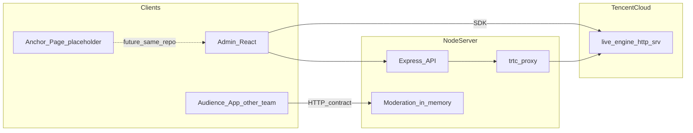

# 直播管理后台：代码结构、云端化与已确认实施路线

## 1. 现有代码基础与组织形式

### 1.1 Monorepo 结构

根目录为 **pnpm workspace**（[`pnpm-workspace.yaml`](/Users/van/Desktop/TUILiveKit_Manager/pnpm-workspace.yaml)），包位于 `packages/*`：

| 包 | 职责 |
|----|------|
| [`packages/common`](/Users/van/Desktop/TUILiveKit_Manager/packages/common) | 共享逻辑：`trtc-client`（腾讯云 `v4/live_engine_http_srv/*` 等）、`room.ts`、`gift.ts`、`chat.ts`、`auth.ts`、HTTP 工厂、部分共享 UI/CSS |
| [`packages/server`](/Users/van/Desktop/TUILiveKit_Manager/packages/server) | Express：`/login`、`/check_config`、`/get_user_sig`、可选 COS 上传、**`/trtc_proxy`** 转发 Live/IM REST |
| [`packages/react`](/Users/van/Desktop/TUILiveKit_Manager/packages/react) | **唯一主线管理端**：Hash Router；依赖 `tuikit-atomicx-react` 做监控/进房/弹幕等 |
| [`packages/vue3`](/Users/van/Desktop/TUILiveKit_Manager/packages/vue3) | **计划移除出维护范围**（收敛前端，见第 4 节） |

### 1.2 数据与调用链（概念）

- **房间/统计/禁言封禁/礼物**：REST + `trtc_proxy`（与「不自建业务主库」一致）。
- **审核队列**：**自建**，首期在 **Node 进程内存**（JSON 可序列化结构），**非**房间主数据持久化；演进路径为 **Redis**。
- **观众端**：**独立团队开发**；与本仓通过 **HTTP 接口契约**对接（拉已发布评论、上报待审评论等），本仓只实现服务端与管理端部分。

---

## 2. 「无本地业务库、以云端 API 为主」边界（仍然成立）

- **房间、成员状态、统计、礼物配置**：仍以腾讯云为准。
- **例外（已接受）**：审核待审队列、机器人规则缓存等 **运营侧短时状态**——首期内存、后续 Redis；浏览器会话凭证（`localStorage`/`sessionStorage`）与部署环境密钥不变。

---

## 3. 已确认产品决策（迭代自您的补充说明）

| 主题 | 决策 |
|------|------|
| 前端收敛 | **执行**：仅维护 **React**；Vue3 从 workspace/脚本中移除，避免双轨。 |
| 开播模式 | **管理员建场 + 下发主播入口**；**主播页不单开仓库**，与本管理后台 **同 monorepo**，但 **当前不建设**，仅占位（路由/页面 stub + 参数约定文档），待您后续补充开播 demo 再实现。 |
| 先审后发 | **自建审核服务**；**观众端**由其他团队开发，本仓 **预留与其交互的 HTTP API**；服务端审核存储 **当前仅内存（JSON 结构）**，以测试实现为主，**预留 Redis 替换层**（接口抽象或注释清晰的 swap 点）。 |
| 机器人 | 按前序规划：**规则**优先 **房间 metadata**（或等价小配置）+ **预留 Worker/回调式接口**；关键词匹配 → 调用现有 `send_text_msg` / `send_custom_msg`（经 `trtc_proxy`）的路径在文档与占位路由中写清。 |
| 观众端 | **独立开发与部署**；本计划只交付 **审核相关 API 契约 + 可选示例请求**（OpenAPI 式 Markdown 或简短 README 片段即可），不负责观众端代码。 |
| 主播端 + 管理后台 | **物理上同仓**；**非当前最紧急**，与主播入口一并 **占位**，等 demo 代码再展开。 |

---

## 4. 实施阶段（执行顺序建议）

### 阶段 A：仓库收敛（可最先执行）

- 修改 [`pnpm-workspace.yaml`](/Users/van/Desktop/TUILiveKit_Manager/pnpm-workspace.yaml) 与根 [`package.json`](/Users/van/Desktop/TUILiveKit_Manager/package.json)，去掉 `livekit-manager-vue3` 相关脚本与依赖引用。
- 可选：将 `packages/vue3` 移入 `archive/` 或删除目录（以您偏好为准；计划默认 **删除或移出 workspace** 以免误装）。

### 阶段 B：评论审核服务（内存版 + 契约）

在 [`packages/server`](/Users/van/Desktop/TUILiveKit_Manager/packages/server) 新增路由模块，例如（名称可调整）：

- `POST /api/moderation/comments` — 观众端 **上报**一条待审评论（body：`roomId`、`messageId` 或 `clientMsgId`、`senderId`、`text`、`timestamp` 等）。
- `GET /api/moderation/comments/pending?roomId=` — 管理端拉 **待审列表**。
- `POST /api/moderation/comments/:id/approve` — 通过：写入「已发布」集合，并触发对观众可见的发布动作（**具体对观众广播方式由观众端团队消费**：例如返回「已发布条目」由观众端轮询/WebSocket 自建，或本服务再调腾讯云发 **custom 消息**；须在契约中二选一并写死首期方案）。
- `POST /api/moderation/comments/:id/reject` — 拒绝：从待审移除。

**存储**：进程内 `Map<string, PendingItem[]>` 或使用单文件式内存对象；重启丢失 **可接受**（测试阶段）。抽象 `ModerationStore` 接口，注释 `// TODO: Redis implementation`。

**鉴权**：测试期可用简单 `X-Internal-Token` 或 IP 限制；文档中列出生产期建议。

### 阶段 C：React 管理端 — 审核 UI

- 新页面或在 [`RoomControl`](/Users/van/Desktop/TUILiveKit_Manager/packages/react/src/views/RoomControl.tsx) 增加 Tab：**待审队列**，调用阶段 B API。
- 与产品确认：控制台内 **BarrageList** 是否仍展示「全量实时」仅供监管，与「观众可见的已发布」分离，避免概念混淆。

### 阶段 D：机器人 — metadata + 占位 API

- 在 `common` 或 `server` 增加 **读写机器人规则 JSON** 的辅助函数（基于已有 `get_room_metadata` / `set_room_metadata` 封装）。
- `GET/PUT /api/robot/rules?roomId=` 占位（或并入 room 配置），说明未来 **Worker** 从 metadata 拉规则并订阅消息源。

### 阶段 E：主播入口占位

- 管理端房间创建/详情中增加 **「主播入口（预览）」** 区块：展示占位 URL，例如 `/#/anchor/live?roomId=...&userId=...`（Hash 与现有路由一致），指向 **空壳页面**「功能开发中」。
- 文档一页：必填 query、与 `get_user_sig` 签发主播账号的约定。

### 阶段 F：React 功能清单与无连麦收敛（非阻塞）

- 列出调用 `pick_user_on_seat` / 麦位 UI 的位置，标记为 **隐藏或二期**（与「纯 OBS、无连麦」一致）。

---

## 5. 对观众端团队的交付物（本仓职责）

- **HTTP API 列表**：路径、方法、请求/响应 JSON 字段、错误码。
- **状态机说明**：`pending` → `approved` | `rejected`；观众端只应展示 `approved` 来源的数据。
- **首期限制**：服务重启丢队列；并发布 **Redis 路线图** 不影响契约字段设计。

---

## 6. 风险与依赖

- **「通过」后观众如何收到**：若观众端不轮询本服务，则需腾讯云侧 **群发 custom 消息** 能力对齐；执行前应用 MCP/文档核对 `send_custom_msg` 与 Live 观众端订阅方式，避免契约与 SDK 能力不一致。
- **重复评论**：`clientMsgId` 去重应在审核服务内完成。

---

## 7. 原文档中已解决的开放问题

- 观众端能否改订阅模型：**是**，由独立团队按契约开发。
- 主播页是否单独仓库：**否**，同仓占位，后期用 demo 填充。
